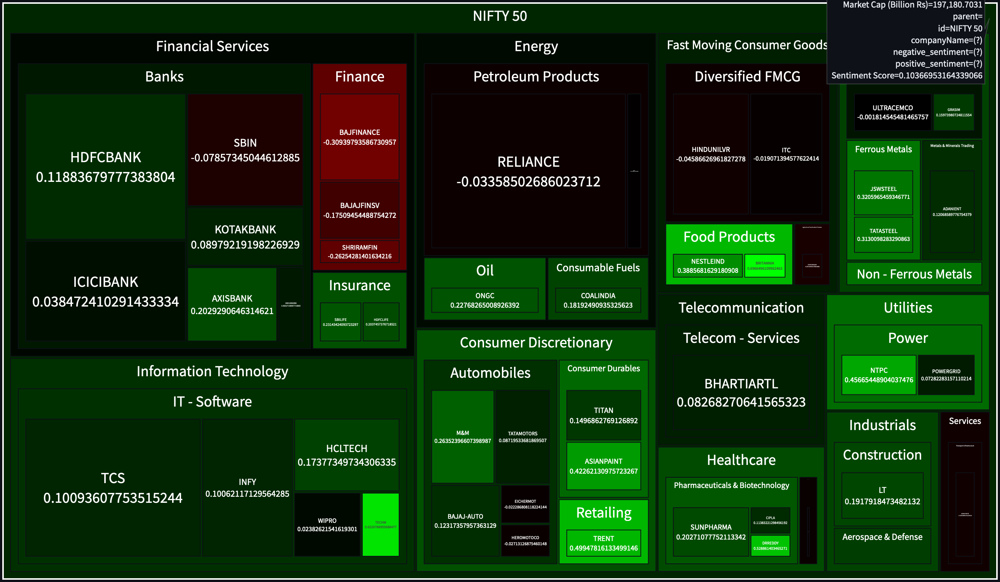

# Nifty Sentiment Analysis Dashboard

[](https://github.com/gsaanchi/Nifty-Sentiment/raw/main/demo%20video/Recording%202025-03-03%20193333.mp4)

[Live Demo on Streamlit Cloud](https://nifty50prediction-gcy7rgascn34iwdty9nnjq.streamlit.app/)

---

## Overview

The **Nifty Sentiment Analysis Dashboard** is an interactive web application designed to provide real-time sentiment insights into stocks comprising the NIFTY 500 index. This project was developed under the **Finance and Economics Club** to empower investors and analysts with market sentiment trends derived from the latest news articles.

By aggregating and analyzing ticker-specific news headlines daily from multiple trusted sources, the dashboard presents an intuitive and dynamic visual summary of investor sentiment across sectors, industries, and individual stocks.

---

## Methodology

The project implements a robust end-to-end data pipeline that involves:

1. **Fetching Ticker Data**

   * Download symbols constituting the NIFTY 500 universe from NSE website.

2. **News Scraping**

   * Scrape news articles for each ticker from Finology, Google Finance, Yahoo Finance, and Ticker Finology.
   * Web scraping is done using Python's `requests` and `BeautifulSoup` (bs4) libraries.
   * Only recent articles (up to 30 days old) are considered, with older or missing data filtered out.

3. **Sentiment Analysis**

   * Headlines are analyzed using the VADER module from NLTK and FinBERT (`mrm8488/distilroberta-finetuned-financial-news-sentiment-analysis`) for more nuanced financial tone detection.
   * Articles are grouped by ticker, and average sentiment scores are computed.

4. **Market Data Integration**

   * Market capitalization and company metadata are fetched using `NSEPython`.
   * Stocks are classified by sector and industry based on Xumit Capital’s indices.

5. **Visualization**

   * An interactive treemap visualization of market sentiment weighted by market cap is created with Plotly.
   * Users can drill down by sector, industry, and individual ticker.
   * A news feed with sentiment scores is available per ticker.

---

## Automation & Deployment

* **GitHub Actions** automate the entire data pipeline including daily news scraping, sentiment computation, and CSV/dashboard file generation.
* Automation runs every 24 hours, producing up-to-date sentiment data without manual intervention.
* The dashboard leverages these CSV files for fast rendering, avoiding repeated scraping and analysis on every user visit.
* This design ensures scalability and prevents server overload even with high user traffic.
* The Streamlit app source code is maintained on the `streamlit` branch, separate from the main data pipeline repository.

---

## Features

* Real-time sentiment aggregation of Nifty 500 stocks from multiple news sources
* Interactive, drillable treemap visualization with sector and industry views
* Stock-specific news feed with sentiment scoring and source links
* Automated daily updates with smart caching for fast load times
* DuckDB for high-performance data storage and indexing
* Support for multiple indices: Nifty 50, 100, 200, 500
* Robust error handling and logging mechanisms
* Comprehensive testing suite for reliability

---

## Architecture & Project Structure

```
├── services/                # Core service modules
│   ├── data_fetcher.py      # Multi-source news aggregation
│   ├── sentiment_analyzer.py # FinBERT & VADER sentiment analysis
│   ├── universe_updater.py  # Index constituent updater
│   └── universe_scheduler.py # Scheduled workflows
├── database/                # DuckDB management
│   └── db_manager.py
├── datasets/                # Data files (CSV, DB)
├── demo video/              # Project demo recordings
├── docs/                    # Documentation
├── res/                     # Images and resources
├── src/                     # Streamlit app & utilities
├── tests/                   # Automated tests
├── .github/                 # GitHub workflows and templates
├── requirements.txt         # Python dependencies
├── Makefile                 # Build and automation commands
├── .python-version          # Python version config
└── README.md                # This file
```

---

## Setup & Installation

1. Clone the repository:

   ```bash
   git clone https://github.com/gsaanchi/Nifty-Sentiment.git
   cd Nifty-Sentiment
   ```

2. (Optional) Create and activate a virtual environment:

   ```bash
   python -m venv venv
   source venv/bin/activate  # Linux/macOS
   venv\Scripts\activate     # Windows
   ```

3. Install dependencies:

   ```bash
   pip install -r requirements.txt
   ```

4. Run the dashboard locally:

   ```bash
   streamlit run src/dashboard-generation.py
   ```

---

## Running Tests

Automated tests ensure the correctness of data pipelines and app functionality:

```bash
pytest tests/
```

---

## Usage

* Use the sidebar to select the stock universe and date range filters.
* Explore the interactive treemap to view aggregated sentiment by sector and stock.
* Select individual stocks to view related news and detailed sentiment analysis.
* Dashboard refreshes daily based on automated data updates.

---

## Tech Stack

* **Frontend:** Streamlit, Plotly
* **Backend:** Python, SQLite (DuckDB)
* **Sentiment Analysis:** VADER (NLTK), FinBERT (HuggingFace)
* **Automation:** GitHub Actions (CI/CD pipeline)
* **Data Sources:** NSE, Google Finance, Yahoo Finance, Finology

---

## Known Limitations

* Occasional delays in news source updates may cause latency in sentiment data.
* News scraping may miss some articles due to site structure changes.
* Sentiment models may misinterpret highly technical or ambiguous headlines.
* Real-time scraping within Streamlit app avoided to prevent performance bottlenecks.


